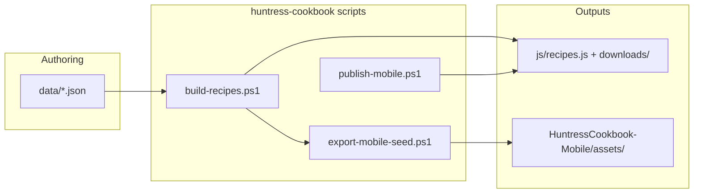

# Huntress Cookbook — Content Authoring & AppGen Import Pipeline


> **Status:** Phase 1 partial — export/publish scripts shipped; YAML authoring deferred  

> **Last updated:** 2026-06-23  

> **Note:** For **generic** AppGen apps (entities, properties, seed rows, Excel round-trip), see AppGen `docs/plans/appgen-spec-workbook.md`.


> **Context:** `HuntressCookbook-Mobile` screens are built. This plan is about **populating cookbook content** and **publishing APKs**, not regenerating Flutter UI from AppGen.


## The key insight


**AppGen does not populate recipe screens from uploaded data.** It scaffolds generic list/detail/form screens from `appgen.json` entities.


**HuntressCookbook-Mobile is different:** custom screens (`HomeScreen`, `ChapterScreen`, `RecipeDetailScreen`, etc.) read **bundled JSON assets** and seed SQLite on first launch. The time-saver is:


```

Author content (JSON in data/) → validate → build → export assets → rebuild/publish app

```


AppGen’s closest patterns:


- **`portal import`** — portal content JSON → manifest

- **`spec import`** — Excel workbook → entities + seed SQL (generic apps)

- **Generated `publish-mobile.ps1`** — generic AppGen mobile apps (outputs `dist/`); Huntress uses its own script under `huntress-cookbook/scripts/`


---


## What the mobile app consumes today


| Asset | Source of truth (web) | Used for |

|-------|----------------------|----------|

| `cookbook_seed.json` | Compiled from `data/*.json` | Recipe records → SQLite |

| `chapters.json` | Chapter sections + intros | Grouping recipes on chapter screens |

| `nav.json` | Drawer / home navigation | Chapter + guide links |

| `guides.json` | Introduction, dietary guide, pantry, future recipes | Guide screens |

| `mobile_config.json` | PIN, title, update URL | App config + OTA check |

| `assets/images/{slug}.jpg` | `data/image-map.json` + downloads | Recipe photos |


**Recipe shape** (seed / mobile, camelCase):


```json

{

  "slug": "cheese-herb-omelette",

  "id": "breakfast-cheese-herb-omelette",

  "name": "Cheese & Herb Omelette",

  "categoryId": "breakfast",

  "category": "Breakfast",

  "status": "untested",

  "description": "...",

  "difficulty": "Easy",

  "prepTime": 5,

  "cookTime": 10,

  "servings": 1,

  "tags": ["Gluten Free", "Breakfast"],

  "ingredients": ["3 eggs", "..."],

  "instructions": ["Crack eggs...", "..."],

  "huntressNotes": "Gluten Free. Onion Free.",

  "foxNotes": "Great beginner recipe.",

  "image": "cheese-herb-omelette.jpg"

}

```


**Web authoring shape** (in `data/breakfast.json` etc.) uses `groups[].recipes[]` with string times (`"5 min"`) and optional `subcategory`, `imagePrompt`, `approved`. The build script normalises these into the mobile seed format.


---


## Recommended authoring formats


### Option A — Keep JSON in `data/` (current)


You already author here.


**Pros:** No new parser; `build-recipes.ps1` already understands this.  

**Cons:** Large chapter files; easy to break JSON syntax.


### Option B — One YAML file per recipe (recommended for new entries)


Deferred — see checklist below.


### Option C — Markdown + YAML frontmatter


Deferred.


### Option D — Spreadsheet for bulk metadata only


Deferred.


**Current recommendation:** **Option A** for all edits; add validation templates when Phase 1 checklist completes.


---


## Pipeline (as built)





### Phase 1 — PowerShell (partial)


| Item | Status |

|------|--------|

| `scripts/export-mobile-seed.ps1` → mobile assets + `mobile_config.json` | **Done** |

| `scripts/publish-mobile.ps1` → `downloads/`, `mobile-version.json` | **Done** |

| `downloads/huntress-cookbook.apk` + web toolbar download | **Done** |

| `docs/templates/recipe.yaml` + `docs/schemas/recipe.schema.json` | Not started |

| `scripts/validate-cookbook.ps1` | Not started |

| YAML recipe loader | Not started |


**Export example:**


```powershell

cd huntress-cookbook/scripts

./build-recipes.ps1

./export-mobile-seed.ps1 -MobileRoot "C:\Users\msvn\source\repos\HuntressCookbook-Mobile"

```


**Publish example (after `flutter build apk --release` in mobile repo):**


```powershell

./publish-mobile.ps1 -ReleaseNotes "Describe what changed"

```


### Phase 2 — AppGen `cookbook import` CLI


Not started — would mirror `PortalSpecImporter` and call the same compile/export logic.


### Phase 3 — AppGen UI tab


Not started.


---


## What AppGen should *not* do for this app


| Approach | Why skip |

|----------|----------|

| Regenerate mobile from generic `Recipe` entity | Loses custom UI (hero image, notes, chapter grouping, PIN gate) |

| Online API + Dio | App is offline-first SQLite |

| Placeholder SQL seed rows | Only one fake row per entity; not 180+ recipes |


Use AppGen for **new app scaffolds** and **generic publish scripts**; use huntress-cookbook scripts for **recipe content** and **Huntress APK hosting**.


---


## Document templates to create


| File | Status |

|------|--------|

| `docs/templates/recipe.yaml` | Planned |

| `docs/templates/chapter.yaml` | Planned |

| `docs/templates/guide.json` | Planned |

| `docs/schemas/recipe.schema.json` | Planned |

| `docs/authoring-guide.md` | Planned |


### Field rules (authoring guide summary)


| Field | Required | Notes |

|-------|----------|-------|

| `slug` | Yes | kebab-case; drives image filename `{slug}.jpg` |

| `name` | Yes | Must match `chapters.json` section `names` entry for grouping |

| `categoryId` | Yes | e.g. `breakfast`, `lunch`, `dinner` |

| `ingredients` | Yes | Array of strings |

| `instructions` | Yes | Array of strings, one step each |

| `prepTime` / `cookTime` | Yes | `"5 min"` or integer minutes (build normalises) |

| `image` | Recommended | Filename only in mobile seed |

| `status` | Optional | `untested`, `approved`, etc. |

| `huntressRating` / `foxRating` | Omit from seed | Set in app only |


---


## Additional ideas


1. **Inbox folder** — Drop `data/inbox/*.yaml`; validate; merge into `data/recipes/`

2. **JSON Schema in CI** — Fail PR on duplicate slugs

3. **Image checklist** — `missing-images.txt` on export

4. **VS Code snippets** — `huntress-recipe` YAML block

5. **Round-trip export** — Mobile SQLite → web JSON (flutter-mobile-app Phase 4)

6. **Single command dev loop:** `sync-cookbook.ps1 -Mobile -Run`


---


## Implementation checklist


### huntress-cookbook repo


- [x] `scripts/export-mobile-seed.ps1` → HuntressCookbook-Mobile `assets/`

- [x] `scripts/publish-mobile.ps1` → `downloads/` + version manifest

- [x] Web mobile layout + APK toolbar link

- [ ] Add `docs/templates/recipe.yaml` and `docs/schemas/recipe.schema.json`

- [ ] Add `docs/authoring-guide.md`

- [ ] Implement `scripts/validate-cookbook.ps1`

- [ ] Optional: YAML recipe loader in build script


### AppGen repo


- [x] Generic mobile `scripts/publish-mobile.ps1` on generate (see `mobile-publish-script.md`)

- [x] Spec workbook for generic entity/seed import

- [ ] `CookbookSpecImporter.cs` + CLI `cookbook import`

- [ ] Optional: Blazor Cookbook export tab


### HuntressCookbook-Mobile repo


- [x] README documents export + publish flow

- [x] In-app update service (Android)

- [x] No screen changes required for content-only updates (asset refresh only)


---


## Related docs


- [flutter-mobile-app.md](./flutter-mobile-app.md) — mobile architecture, phases, paths

- [downloads/README.md](../../downloads/README.md) — sideload instructions

- Web build: `scripts/build-recipes.ps1`

- Mobile seed importer: `HuntressCookbook-Mobile/lib/core/data/seed_importer.dart`

