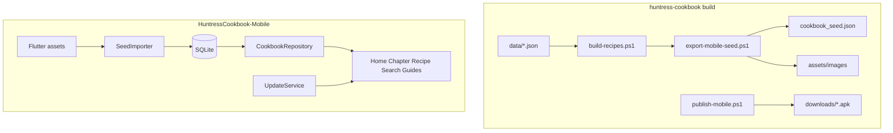

# Huntress Cookbook — Offline Flutter App (AppGen)

> **Status:** Shipped (v1) — polish / content pipeline ongoing  

> **Last updated:** 2026-06-23  

> **Mobile repo:** `HuntressCookbook-Mobile` (`source/repos/HuntressCookbook-Mobile`)  

> **Reference app:** `AppGen/output/FlutterMobileApp Mobile` (AppGen demo patterns only)  

> **Decisions:** Full on-device CRUD; offline only (no API/online DB).

## Goal

Offline Flutter client that mirrors the website: chapter navigation, recipe browse/detail with photos, search, guide pages, status badges, star ratings, and **full recipe CRUD** — all **offline**.

The web app’s HTML pages are **not** ported. Data comes from the same compiled model as [`js/recipes.js`](../../js/recipes.js) (~182 recipes).

---

## Reference vs shipped app

| | Reference | Shipped |

|---|-----------|---------|

| Path | `AppGen/output/FlutterMobileApp Mobile` | `repos/HuntressCookbook-Mobile` |

| Purpose | AppGen demo (MobileUser, MobileLocation, MobileBooks) | Huntress Cookbook |

| Data | Dio → localhost API | SQLite + bundled seed JSON |

| Theme | Navy sidebar `#1B3A5C` | Forest green `#1a3d2e` per [`cookbook.css`](../../css/cookbook.css) |

**Copied from reference:** `GoRouter` + `AppShell`, `AppDrawer`, Riverpod, feature folders, `AppPageHeader`, loading/empty widgets.

**Custom (not from AppGen CRUD):** SQLite repository, cookbook screens, seed importer, update service, PIN gate.

---

## What to reuse from huntress-cookbook

| Asset | Location | Mobile use |

|-------|----------|------------|

| Recipe + chapter model | [`scripts/build-recipes.ps1`](../../scripts/build-recipes.ps1) → `HUNTRESS_COOKBOOK` | Seed import |

| UI behaviour | [`js/cookbook.js`](../../js/cookbook.js) | Nav, status/ratings, screen flows |

| Images | `assets/images/{slug}.jpg` (~164 on disk) | Flutter `assets/images/` |

| Export script | [`scripts/export-mobile-seed.ps1`](../../scripts/export-mobile-seed.ps1) | Build-time asset bundle |

| Publish script | [`scripts/publish-mobile.ps1`](../../scripts/publish-mobile.ps1) | APK → `downloads/`, `mobile-version.json`, refresh `mobile_config.json` |

| Web APK download | `downloads/huntress-cookbook.apk`, toolbar phone icon | Sideload + in-app update URL |

---

## Architecture

1. **Build time:** `export-mobile-seed.ps1` emits JSON + copies images into Flutter `assets/`.

2. **First launch:** import seed into SQLite (skip if already seeded).

3. **Runtime:** all browse/search/CRUD via SQLite.

4. **Updates:** app checks `mobile-version.json` on launch (when online); download + install flow on Android.

5. **No API** — Dio removed.

---

## AppGen relationship

HuntressCookbook-Mobile was bootstrapped from AppGen patterns but is **maintained as a custom app**. Regenerating from a generic `Recipe` entity would overwrite custom screens.

For **new** AppGen apps, see the AppGen repo plans:

- `docs/plans/appgen-spec-workbook.md` — entity/seed import
- `docs/plans/mobile-publish-script.md` — generated `scripts/publish-mobile.ps1` → `dist/`

---

## Recipe schema (SQLite)

| Column | Type | Notes |

|--------|------|-------|

| slug | TEXT PK | e.g. `butternut-soup` |

| name, description, category_id, category, status, difficulty | TEXT | |

| prep_time, cook_time, servings | INT | |

| ingredients_json, instructions_json, tags_json | TEXT | JSON arrays |

| huntress_notes, fox_notes, image | TEXT | |

| huntress_rating, fox_rating | INT | 0–5 |

Bundled assets: `cookbook_seed.json`, `chapters.json`, `nav.json`, `guides.json`, `assets/images/`, `mobile_config.json`.

---

## Screen map

| Web | Flutter | Status |

|-----|---------|--------|

| [`index.html`](../../index.html) | `HomeScreen` | Done |

| Chapter pages | `ChapterScreen` | Done |

| Recipe page | `RecipeDetailScreen` + photo | Done |

| (new) | `RecipeFormScreen` | Done |

| Search modal | `SearchScreen` | Done |

| Guides | `GuideScreen` | Done |

| Auth gate | `PinGateScreen` | Done |

| Approved meals | `ChapterScreen` (filtered) | Done |

---

## Visual parity

| Token | Web | Mobile |

|-------|-----|--------|

| Sidebar | `#1a3d2e` | `#1a3d2e` |

| Accent | `#c9a227` | `#c9a227` |

| Background | `#f5f0e8` | `#f5f0e8` |

| Body font | Cormorant Garamond | `google_fonts` |

| Script font | Dancing Script | taglines |

**Web mobile layout (2026-06):** off-canvas sidebar, responsive headings, scrollable toolbar, APK download button on desktop (`css/cookbook.css`, `js/cookbook.js`).

---

## Implementation phases

### Phase 1 — Scaffold, theme, browse — **Done**

- [x] Plan doc

- [x] `export-mobile-seed.ps1` + assets

- [x] SQLite + seed importer

- [x] Forest-green theme + drawer nav

- [x] Home → Chapter → Recipe detail with images

### Phase 2 — CRUD and ratings — **Done**

- [x] Recipe create/edit/delete

- [x] Star ratings + status badges

- [x] FAB on chapter screens

### Phase 3 — Search, auth, guides — **Done**

- [x] Search screen

- [x] Introduction, dietary guide, pantry, future recipes

- [x] Local PIN gate

### Phase 4 — Polish — **Mostly done**

- [x] Share recipe (`share_plus`)

- [x] Missing image placeholders

- [x] App icon / splash from fox logo

- [x] In-app update check + APK download/install (Android)

- [x] Web: APK in `downloads/`, toolbar download, `publish-mobile.ps1`

- [ ] Optional: export SQLite → web JSON (round-trip)

- [ ] YAML-per-recipe authoring (see content-authoring-pipeline.md)

---

## Hand-maintained files (safe from AppGen regen)

- `lib/core/data/*` — SQLite, seed importer, repository

- `lib/features/home/*`, `chapter/*`, `recipe/*`, `search/*`, `guides/*`, `auth/*`

- `lib/core/services/update_*.dart`

- `lib/app/app_theme_config.dart`, `app_drawer.dart`, `router.dart`

- `assets/*`

---

## Out of scope (v1)

- Online sync, cloud backup, WebView of HTML site

- Editing chapter structure via UI

---

## Key paths

| File | Repo |

|------|------|

| `HuntressCookbook-Mobile/` | `source/repos/HuntressCookbook-Mobile` |

| `scripts/export-mobile-seed.ps1` | huntress-cookbook |

| `scripts/publish-mobile.ps1` | huntress-cookbook |

| `downloads/huntress-cookbook.apk` | huntress-cookbook (GitHub Pages) |

| `output/FlutterMobileApp Mobile/` | AppGen (reference only) |

