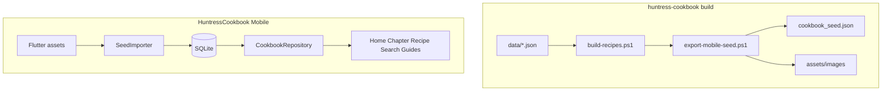

# Huntress Cookbook — Offline Flutter App (AppGen)

> **Status:** In progress  
> **Reference app:** `AppGen/output/FlutterMobileApp Mobile` (patterns only — do not modify)  
> **Target app:** `AppGen/output/HuntressCookbook Mobile`  
> **Decisions:** New Huntress project; full on-device CRUD; offline only (no API/online DB).

## Goal

Create **`output/HuntressCookbook Mobile`** that mirrors the website: chapter navigation, recipe browse/detail with photos, search, guide pages, status badges, star ratings, and **full recipe CRUD** — all **offline**.

The web app’s HTML pages are **not** ported. Data comes from the same compiled model as [`js/recipes.js`](../../js/recipes.js) (~182 recipes).

---

## Reference vs new app

| | Reference | Target |
|---|-----------|--------|
| Path | `AppGen/output/FlutterMobileApp Mobile` | `AppGen/output/HuntressCookbook Mobile` |
| Purpose | AppGen demo (MobileUser, MobileLocation, MobileBooks) | Huntress Cookbook |
| Data | Dio → localhost API | SQLite + bundled seed JSON |
| Theme | Navy sidebar `#1B3A5C` | Forest green `#1a3d2e` per [`cookbook.css`](../../css/cookbook.css) |

**Copy from reference:** `GoRouter` + `AppShell`, `AppDrawer`, Riverpod, feature folders, `AppPageHeader`, loading/empty widgets.

**Do not copy:** Dio/API services, demo entities, navy palette.

---

## What to reuse from huntress-cookbook

| Asset | Location | Mobile use |
|-------|----------|------------|
| Recipe + chapter model | [`scripts/build-recipes.ps1`](../../scripts/build-recipes.ps1) → `HUNTRESS_COOKBOOK` | Seed import |
| UI behaviour | [`js/cookbook.js`](../../js/cookbook.js) | Nav, status/ratings, screen flows |
| Images | `assets/images/{slug}.jpg` (~164 on disk) | Flutter `assets/images/` |
| Export script | [`scripts/export-mobile-seed.ps1`](../../scripts/export-mobile-seed.ps1) | Build-time asset bundle |

---

## Architecture



1. **Build time:** `export-mobile-seed.ps1` emits JSON + copies images into Flutter `assets/`.
2. **First launch:** import seed into SQLite (skip if already seeded).
3. **Runtime:** all browse/search/CRUD via SQLite.
4. **No network** — Dio stubbed/removed.

---

## AppGen manifest

**`AppGen/output/HuntressCookbook/appgen.json`:**

| Setting | Value |
|---------|-------|
| `ApplicationName` | `HuntressCookbook` |
| `Targets.Web.Enabled` | `false` |
| `Targets.Mobile.Enabled` | `true` |
| `Targets.Mobile.Offline.Enabled` | `true` |
| `Targets.Mobile.Theme.Preset` | `cookbook` |
| `Targets.Mobile.Capabilities.Enabled` | `share` |
| Entity | `Recipe` (bootstrap CRUD; custom screens replace generated UI) |

Generate:

```powershell
cd AppGen
dotnet run --project src/AppGen.CLI -- mobile create --project output/HuntressCookbook
```

Post-gen: custom SQLite repository uses **slug** as primary key (overrides generated long `Recipe_Id` routing).

---

## Recipe schema (SQLite)

| Column | Type | Notes |
|--------|------|-------|
| slug | TEXT PK | e.g. `butternut-soup` |
| name, description, category_id, category, status, difficulty | TEXT | |
| prep_time, cook_time, servings | INT | |
| ingredients_json, instructions_json, tags_json | TEXT | JSON arrays |
| huntress_notes, fox_notes, image | TEXT | |
| huntress_rating, fox_rating | INT | 0–5 |

Bundled assets: `cookbook_seed.json`, `chapters.json`, `nav.json`, `guides.json`, `assets/images/`.

---

## Screen map

| Web | Flutter | Phase |
|-----|---------|-------|
| [`index.html`](../../index.html) | `HomeScreen` | 1 |
| Chapter pages | `ChapterScreen` | 1 |
| Recipe page | `RecipeDetailScreen` + photo | 1 |
| (new) | `RecipeFormScreen` | 2 |
| Search modal | `SearchScreen` | 3 |
| Guides | `GuideScreen` | 3 |
| Auth gate | `PinGateScreen` | 3 |
| Approved meals | `ChapterScreen` (filtered) | 3 |

---

## Visual parity

| Token | Web | Target mobile |
|-------|-----|---------------|
| Sidebar | `#1a3d2e` | `#1a3d2e` |
| Accent | `#c9a227` | `#c9a227` |
| Background | `#f5f0e8` | `#f5f0e8` |
| Body font | Cormorant Garamond | `google_fonts` |
| Script font | Dancing Script | taglines |

---

## Implementation phases

### Phase 1 — Scaffold, theme, browse
- [x] Update this plan doc
- [ ] `HuntressCookbook` manifest + generate mobile app
- [ ] `export-mobile-seed.ps1` + assets
- [ ] SQLite + seed importer
- [ ] Forest-green theme + drawer nav
- [ ] Home → Chapter → Recipe detail with images

### Phase 2 — CRUD and ratings
- [ ] Recipe create/edit/delete
- [ ] Star ratings + status badges
- [ ] FAB on chapter screens

### Phase 3 — Search, auth, guides
- [ ] Search screen
- [ ] Introduction, dietary guide, pantry, future recipes
- [ ] Local PIN gate

### Phase 4 — Polish
- [ ] Share recipe (`share_plus`)
- [ ] Missing image placeholders
- [ ] App icon / splash from fox logo
- [ ] Optional: export SQLite → web JSON

---

## Hand-maintained files (safe from AppGen regen)

- `lib/core/data/*` — SQLite, seed importer, repository
- `lib/features/home/*`, `chapter/*`, `recipe/*`, `search/*`, `guides/*`, `auth/*`
- `lib/app/app_theme_config.dart`, `app_drawer.dart`, `router.dart`
- `assets/*`

---

## Out of scope (v1)

- Online sync, cloud backup, WebView of HTML site
- Editing chapter structure via UI

---

## Key paths

| File | Repo |
|------|------|
| `output/HuntressCookbook/appgen.json` | AppGen |
| `output/HuntressCookbook Mobile/` | AppGen |
| `output/FlutterMobileApp Mobile/` | AppGen (reference only) |
| `scripts/export-mobile-seed.ps1` | huntress-cookbook |
