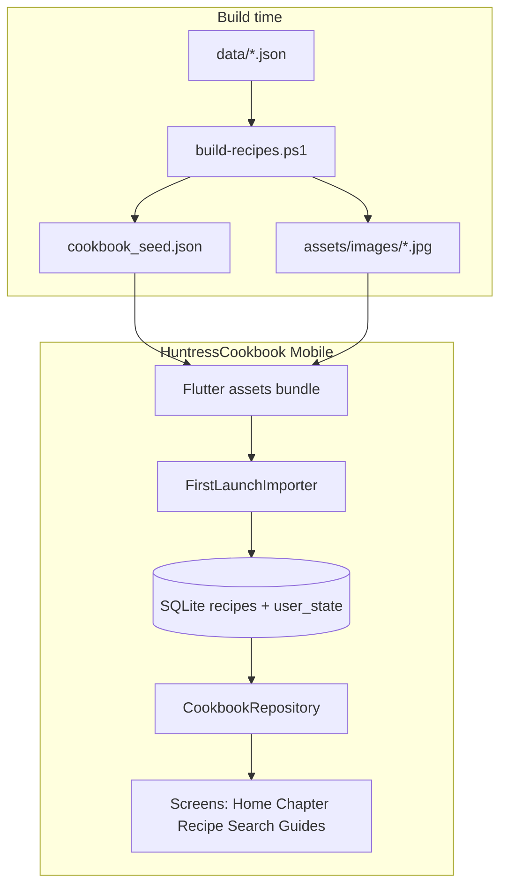

# Huntress Cookbook — Offline Flutter App (AppGen)

> **Status:** Planned (not implemented)  
> **Decisions:** AppGen output at `output/HuntressCookbook Mobile`; full on-device CRUD; offline only (no API/online DB).

## Goal

Create **`output/HuntressCookbook Mobile`** (new AppGen project) that mirrors the website’s look and behaviour: chapter navigation, recipe browse/detail, search, guide pages, status badges, star ratings, and **full recipe CRUD** — all **offline**, with **no API or online database**.

The web app’s 221 HTML pages are **not** ported. The mobile app uses the same compiled data model as [`js/recipes.js`](../../js/recipes.js) (182 recipes at time of writing).

---

## What you already have (and what to reuse)

| Asset | Location | Mobile use |
|-------|----------|------------|
| Recipe + chapter model | [`scripts/build-recipes.ps1`](../../scripts/build-recipes.ps1) → `HUNTRESS_COOKBOOK` | Seed import |
| Search index logic | Same build script → [`js/search-index.js`](../../js/search-index.js) | Rebuild in-app or bundle index JSON |
| UI behaviour reference | [`js/cookbook.js`](../../js/cookbook.js) | Screen flows, nav, status/ratings rules |
| Images | `assets/images/{slug}.jpg` | Flutter `assets/images/` |
| AppGen shell pattern | `AppGen/output/Flutter_App Mobile` | Router, drawer, theme, feature folders |

**AppGen template today:** API-first (Dio → `localhost:5000`). `AppGen/output/Flutter_App/appgen.json` has `Offline.Enabled: false`. The generated offline layer is a **JSON key-value cache**, not relational CRUD — so **full offline CRUD requires custom SQLite repositories** after generation.

**Theme gap:** AppGen `cookbook` preset uses navy sidebar (`#1B3A5C`); Huntress web uses **forest green** (`#1a3d2e`) per [`css/cookbook.css`](../../css/cookbook.css). Update `app_theme_config.dart` after gen.

---

## Recommended architecture



**Data flow:**

1. **First launch:** import `assets/cookbook_seed.json` into SQLite (skip if DB already seeded).
2. **Runtime:** all browse/search/CRUD reads and writes SQLite.
3. **User state:** ratings, auth-unlocked flag, optional draft edits — same DB or `shared_preferences` for simple flags.
4. **No network layer** — remove or stub Dio/`api_client.dart` from generated code.

This gives true offline CRUD without an online DB. Sync back to the web JSON is a **later** problem (export script), not v1.

---

## AppGen manifest (new project)

Create **`AppGen/output/HuntressCookbook/appgen.json`** (new app, do not overwrite `Flutter_App`):

| Setting | Value | Why |
|---------|-------|-----|
| `ApplicationName` | `HuntressCookbook` | Output: `HuntressCookbook Mobile` |
| `Targets.Web.Enabled` | `false` | No API dependency |
| `Targets.Mobile.Enabled` | `true` | Flutter client |
| `Targets.Mobile.Offline.Enabled` | `true` | sqflite in `pubspec` (extend beyond generic cache) |
| `Targets.Mobile.Theme.Preset` | `cookbook` | Starting point; then recolor to forest green |
| `Targets.Mobile.ApiBaseUrl` | unused | Services replaced post-gen |

**Entities (minimal for generator CRUD scaffolding):**

Primary entity **`Recipe`** with AppGen-friendly flat fields (arrays as JSON strings):

- `Recipe_Id` (string, key) — use **slug** (`butternut-soup`), not auto-increment long
- `Name`, `Description`, `CategoryId`, `Category`, `Status`, `Difficulty`
- `PrepTime`, `CookTime`, `Servings` (int)
- `IngredientsJson`, `InstructionsJson`, `TagsJson` (string)
- `HuntressNotes`, `FoxNotes`, `Image` (filename)
- `HuntressRating`, `FoxRating` (int, 0–5)

Optional read-only config bundled as assets (not CRUD entities for v1):

- `chapters.json` — from `HUNTRESS_COOKBOOK.chapters` + `chapterIntros`
- `nav.json` — from `COOKBOOK_NAV` (move out of hardcoded JS eventually)
- `guides.json` — introduction, dietary guide, pantry, future recipes

Generate via AppGen CLI:

```powershell
dotnet run --project src/AppGen.CLI -- mobile create --project output/HuntressCookbook [--force]
```

---

## Build pipeline addition (cookbook repo)

Extend [`scripts/build-recipes.ps1`](../../scripts/build-recipes.ps1) (or add `scripts/export-mobile-seed.ps1`) to emit:

1. **`cookbook_seed.json`** — full `HUNTRESS_COOKBOOK` object as JSON (strip plaintext `settings.auth.password` or replace with a mobile-only flag).
2. **`search_index.json`** — same entries as `search-index.js` (optional; can also search SQLite).
3. Copy step (manual or script) into `AppGen/output/HuntressCookbook Mobile/assets/`.

Register in Flutter `pubspec.yaml`:

```yaml
assets:
  - assets/cookbook_seed.json
  - assets/chapters.json
  - assets/images/
```

**Image bundle:** ~182 slots; run existing image download script before export. Consider lazy bundling or “images on first Wi‑Fi” only if APK size is a concern — for offline-only, bundle all mapped JPGs (~20–40 MB).

---

## Screen map (web → Flutter)

| Web | Flutter screen | Notes |
|-----|----------------|-------|
| [`index.html`](../../index.html) | `HomeScreen` | Logo, tagline, chapter list |
| Chapter pages | `ChapterScreen` | Sections from `chapters.json`; recipe rows with status chip |
| Recipe page | `RecipeDetailScreen` | **Custom** — hero image, meta row, ingredients, method, Huntress/Fox notes, stars |
| (new) | `RecipeFormScreen` | **Custom** — dynamic ingredient/step lists, image picker |
| Search modal | `SearchScreen` | Fuse.dart or SQLite `LIKE` on title + ingredients |
| Introduction / guides | `GuideScreen` | Render markdown-like sections from bundled JSON |
| Auth gate | `PinGateScreen` | Local PIN check; store unlock in secure storage |
| Approved meals | `ApprovedMealsScreen` | Filter `status = approved` or rating ≥ threshold |
| Toolbar print | Share / export | `share_plus` — share recipe text |

**Navigation:** keep AppGen’s **GoRouter + drawer** pattern (`router.dart`, `app_shell.dart`). Replace demo entities in drawer with cookbook chapters + guides.

**Recipe prev/next:** pass `chapterId` + `sectionTitle` in route extras (web uses `document.referrer` — unreliable on mobile).

---

## Custom code vs generated code

AppGen will generate generic **list / detail / form** with flat `_DetailRow` widgets. **Replace** for recipes:

- `lib/features/recipe/screens/recipe_detail_screen.dart` — cookbook layout
- `lib/features/recipe/screens/recipe_form_screen.dart` — list editors for ingredients/instructions
- `lib/features/recipe/services/recipe_service.dart` — **SQLite**, not Dio
- `lib/core/data/cookbook_database.dart` — schema + migrations
- `lib/core/data/seed_importer.dart` — one-time import from `cookbook_seed.json`

Keep generated shell: `main.dart`, router structure, `AppShell`, shared widgets (`AppLoadingState`, `AppEmptyState`), theme files.

**Regeneration rule:** After first scaffold, treat `appgen.json` as bootstrap only; document which files are safe to regen vs hand-maintained.

---

## Feature parity checklist

| Feature | v1 | Implementation |
|---------|-----|----------------|
| Chapter browse | Yes | `chapters.json` + SQLite recipe lookup by slug |
| Recipe detail | Yes | Custom detail screen |
| Recipe CRUD | Yes | SQLite + custom form |
| Search | Yes | Fuse or FTS |
| Status badges | Yes | Map `status` → chip colors (match web CSS semantics) |
| Star ratings | Yes | Persist to SQLite (`huntressRating`); update status rules from [recipe-status-and-ratings.md](./recipe-status-and-ratings.md) |
| Guide pages | Yes | Bundled JSON renderers |
| Password gate | Yes | Local PIN; do not ship web password in seed JSON |
| Photo rows on chapters | v1.1 | Horizontal `ListView` of thumbnails |
| Print PDF | No | Use share instead |
| Web HTML parity | No | Not needed |

---

## Visual parity (look like the website)

Update generated theme:

| Token | Web (`cookbook.css`) | AppGen default |
|-------|----------------------|----------------|
| Sidebar | `#1a3d2e` | `#1B3A5C` → **change** |
| Accent | `#c9a227` | `#C9A227` ✓ |
| Background | `#f5f0e8` | `#F5F0E6` ✓ |
| Body font | Cormorant Garamond | Inter → **switch** via `google_fonts` |
| Script font | Dancing Script | Use for taglines/captions |

Chapter UI: numbered sections, emoji section icons (from `chapters[].icon`), heart-bullet recipe lists, 3-up photo row optional in v1.1.

---

## Implementation phases

### Phase 1 — Scaffold and seed (browse-only foundation)

- [ ] Create `HuntressCookbook` `appgen.json`; generate `HuntressCookbook Mobile`
- [ ] Add `export-mobile-seed.ps1`; wire assets
- [ ] Implement SQLite schema + first-launch importer
- [ ] Home + Chapter + Recipe detail (read-only)
- [ ] Forest-green theme + fonts

### Phase 2 — CRUD and ratings

- [ ] Recipe create/edit/delete in SQLite
- [ ] Star ratings + status badge sync (local rules)
- [ ] FAB / “Add recipe” on chapter screens
- [ ] Image: pick from gallery or keep filename reference

### Phase 3 — Search, auth, guides

- [ ] Search screen (Fuse or FTS)
- [ ] PIN gate on cold start
- [ ] Introduction, dietary guide, pantry, future recipes screens
- [ ] Approved meals filtered view

### Phase 4 — Polish (optional)

- [ ] Photo rows on chapter screens
- [ ] Export SQLite → JSON for merging back into web `data/*.json`
- [ ] Android/iOS icons and splash using fox logo

---

## Risks and mitigations

| Risk | Mitigation |
|------|------------|
| AppGen regen wipes custom screens | Freeze manifest; maintain custom recipe feature outside regen path |
| Generic CRUD inadequate for recipes | Budget time for custom detail/form (expected) |
| Two data sources (web JSON vs phone DB) diverge | v1: phone is independent; later: export/import script |
| Large APK from images | Bundle subset first; or compress JPGs in export script |
| `Recipe_Id` as string key | Configure in AppGen or override model post-gen (slug is required for image filenames) |
| Missing images in repo | Run `download-images-from-map.ps1` before mobile export |

---

## Out of scope (v1)

- Online sync, user accounts, cloud backup
- Editing chapter structure / nav via UI
- WebView wrapper of existing HTML site
- Regenerating 207 recipe HTML pages on mobile

---

## Key files to create or modify

| File | Action |
|------|--------|
| `AppGen/output/HuntressCookbook/appgen.json` | **New** manifest |
| `AppGen/output/HuntressCookbook Mobile/` | **Generated** Flutter app |
| `huntress-cookbook/scripts/export-mobile-seed.ps1` | **New** — JSON + asset copy |
| `huntress-cookbook/scripts/build-recipes.ps1` | **Edit** — call export or emit `cookbook_seed.json` |
| `HuntressCookbook Mobile/lib/app/app_theme_config.dart` | **Edit** — forest green palette |
| `HuntressCookbook Mobile/lib/core/data/*` | **New** — SQLite + seed |
| `HuntressCookbook Mobile/lib/features/recipe/*` | **Replace** generated CRUD with cookbook UI |
